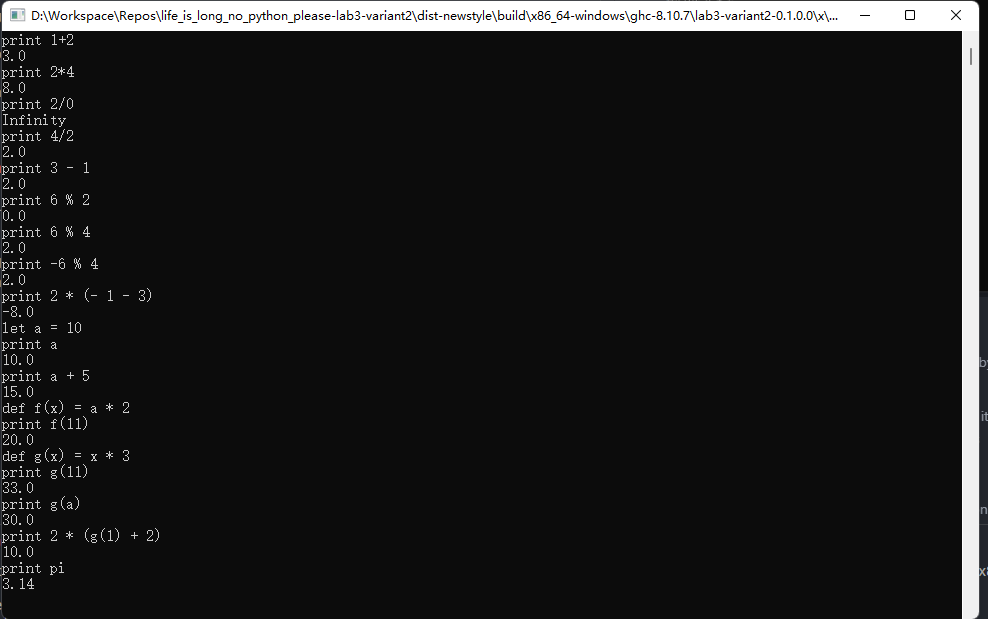

# CPO_life_is_long_no_python_please

## Description

### Objectives

- Design an embedded domain-specific language or a simple text parser.

- Design architecture of a simple interpreter.

- Develop a simple interpreter for a specific model of computation.

- Develop unit tests.

- Develop input data control in the aspect-oriented style.

In the second laboratory work, students should develop a simple interpreter
for the specific model of computation. For that, you need:

- Design an input language. Depends on your variant, it should be:

  - an embedded domain-specific (eDSL) language

  - a string with specific syntax and semantic.

- Design types for MoC object representation and interpreter

- Implement an interpreter for computational process models (descriptions)

  - define different computational process models

  - execute them separately with computational process trace

  - execute them with different input data

  - visualize computational process models.

- Testing. Should include:

  - several simple examples of interpreter usages

  - at least one complex example

  - cornet cases.

- Input data validation in aspect-oriented style.

## Variant

- No.2 Mathematical expression by string substitution

## Struct of project

- The calculator.hs in app/ is the implementation.

- The test runs by the cabal, and the test cases are in test/*.hs.

## Key features

- The use of Haskell.

- Achieve a calculator works like `REPL`

- Support default variable like `pi`.

- Support declaration of variable.

- Support user-define function with one parameter.

## Usage

```
runghc app/calculator.hs
```

or execute

```
build --enable-tests --enable-benchmarks all
```

And then you will get an executable program.

To declare a var:

```
let a = 1
```

To define a function:

```
def f(a) = a * 2
```

Only one parameter is support in function definition.

To evaluate a expression:

```
print <Expression>
```

## Test

I didn't find a way to test it in the Unit test, sorry for that.
I just build unit test for the old version, and the following is for new one



## Design note

In the begining, I tried to load the expression byte by byte
and eval it by stack, but it's really inefficient.
Previous version is `src/MathExpression.hs`

Finally I imitate others to implement it with Parsec, it's
so convient to convert every part of the string into Expressions.
New version is `app/calculator.hs`

## Contribution

Zhao, Tianhao is responsible for the implementation of the
data structure and some test cases.

Ge, Binghang edit the Readme and contribute some test cases,
also the action.